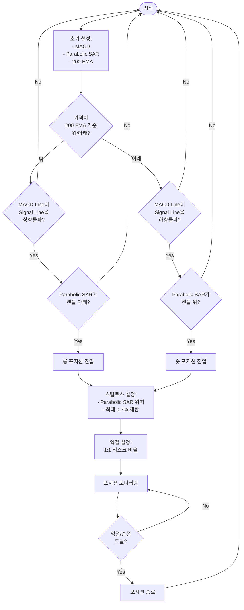
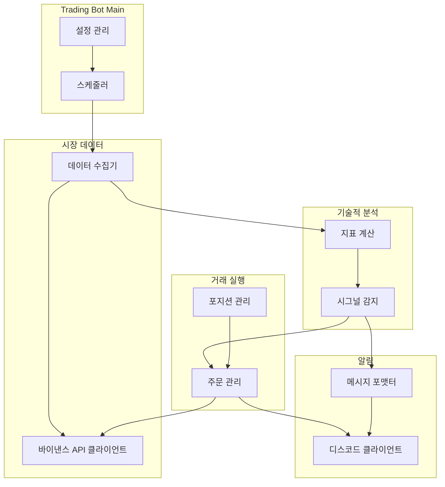

# phoenix

## Windows 용 build 하는 법

```bash
# 명령 프롬프트(cmd)에서:
GOOS=windows GOARCH=amd64 go build -o phoenix ./cmd/trader

# PowerShell에서:
$env:GOOS="windows"; $env:GOARCH="amd64"; go build -o phoenix ./cmd/trader
```

## Linux 용 build 하는 법

```bash
# 명령 프롬프트(cmd)에서:
GOOS=linux GOARCH=amd64 go build -o phoenix ./cmd/trader

# PowerShell에서:
$env:GOOS="linux"; $env:GOARCH="amd64"; go build -o phoenix ./cmd/trader
```


## Linux에서 백그라운드 실행하는 법

```bash
nohup ./phoenix &
```

```bash
nohup ./phoenix > /dev/null 2>&1 &
```


## 정상 종료 하는 방법

```bash
ps aux | grep phoenix

# 정상 종료
kill -15 [PID번호]

# 강제 종료 (필요시)
kill -9 [PID번호]
```

## 가상환경 생성하기
```bash
# Windows
python -m venv myenv

# macOS/Linux
python3 -m venv myenv
```

## 가상환경 활성화하기
```bash
# Windows (PowerShell)
.\myenv\Scripts\Activate.ps1

# Windows (CMD)
myenv\Scripts\activate

# macOS/Linux
source myenv/bin/activate
```
활성화되면 터미널 프롬프트 앞에 (myenv)가 표시됩니다.

## 가상환경 비활성화하기
```bash
deactivate
```

## requirements.txt 관리하기

### requirements.txt 생성하기
현재 환경에 설치된 모든 패키지를 requirements.txt 파일로 저장:
```bash
pip freeze > requirements.txt
```

### requirements.txt로 패키지 설치하기
```bash
pip install -r requirements.txt
```

## 매매 알고리즘




## 프로그램 아키텍처


