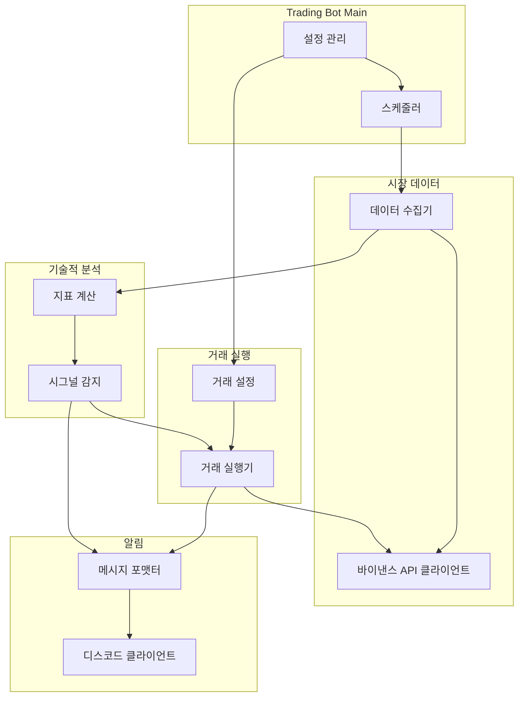

```mermaid
flowchart TD
    subgraph Main[Trading Bot Main]
        Config[설정 관리]
        Scheduler[스케줄러]
    end

    subgraph Market[시장 데이터]
        Binance[바이낸스 API 클라이언트]
        DataCollector[데이터 수집기]
    end

    subgraph Analysis[기술적 분석]
        Calculator[지표 계산]
        SignalDetector[시그널 감지]
    end

    subgraph Trading[거래 실행]
        Executor[거래 실행기]
        Settings[거래 설정]
    end

    subgraph Notification[알림]
        Discord[디스코드 클라이언트]
        MessageFormatter[메시지 포맷터]
    end

    Config --> Scheduler
    Config --> Settings
    Settings --> Executor
    
    Scheduler --> DataCollector
    DataCollector --> Binance
    DataCollector --> Calculator
    
    Calculator --> SignalDetector
    SignalDetector --> Executor
    Executor --> Binance
    
    SignalDetector --> MessageFormatter
    Executor --> MessageFormatter
    MessageFormatter --> Discord
```