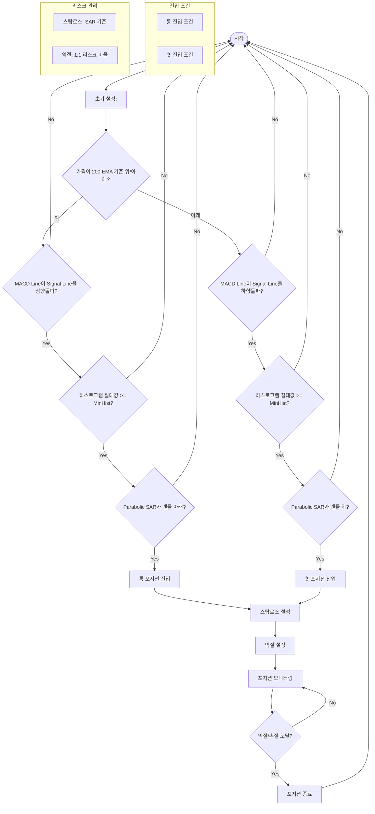

롱(Long) 포지션 진입 조건:

가격이 EMA200보다 높음 (price > EMA200)
Parabolic SAR가 현재 봉의 저가보다 낮음 (SAR < Low)
MACD가 시그널라인을 상향돌파 (MACD가 Signal Line을 아래에서 위로 크로스)

숏(Short) 포지션 진입 조건:

가격이 EMA200보다 낮음 (price < EMA200)
Parabolic SAR가 현재 봉의 고가보다 높음 (SAR > High)
MACD가 시그널라인을 하향돌파 (MACD가 Signal Line을 위에서 아래로 크로스)

